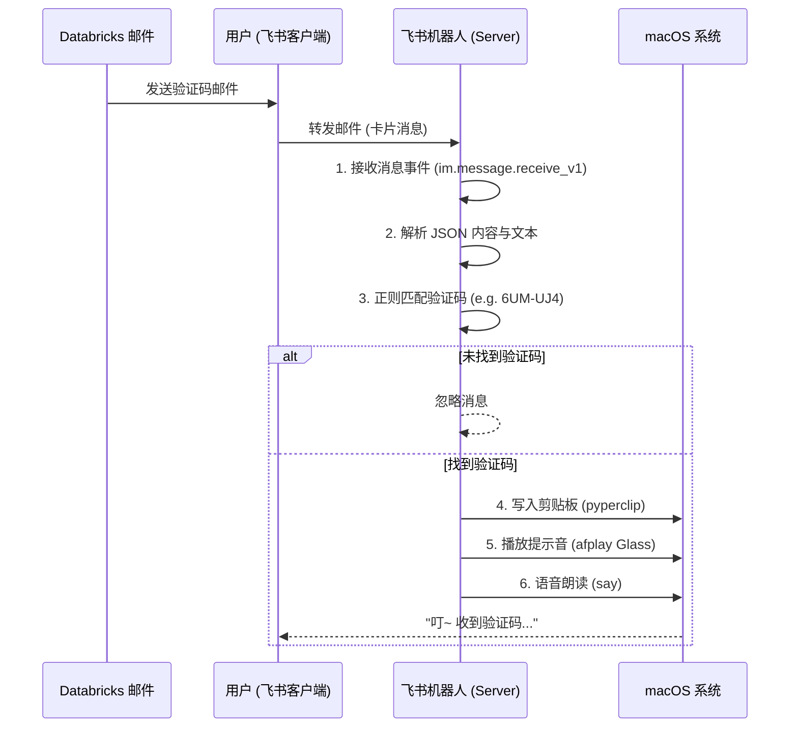

# 飞书 Databricks 验证码助手文档

本项目实现了一个自动化的验证码提取工具，通过飞书机器人接收 Databricks 的验证邮件通知，自动提取其中的验证码并复制到 macOS 剪贴板，同时进行语音提醒。

## 1. 核心功能

*   **实时监听**：使用飞书长连接 (WebSocket) 模式监听机器人消息。
*   **智能提取**：针对 Databricks 邮件格式，自动解析 `interactive` 卡片消息或文本消息。
*   **正则匹配**：精准提取类似 `RHV-49A` 格式的验证码。
*   **自动复制**：提取成功后立即写入系统剪贴板。
*   **语音通知**：播放系统提示音并朗读验证码。

## 2. 工作流程图



## 3. 环境与依赖

*   **系统**：macOS (依赖 `say` 和 `afplay` 命令及系统剪贴板)
*   **语言**：Python 3.11+
*   **依赖库**：
    *   `lark-oapi`: 飞书官方 SDK
    *   `pyperclip`: 剪贴板操作库

### 安装依赖
```bash
pip install -r requirements.txt
```
*(需包含 `lark-oapi` 和 `pyperclip`)*

## 4. 配置与运行

1.  **配置文件**：确保 `src/config.py` 中已填入正确的 `APP_ID` 和 `APP_SECRET`。
2.  **飞书权限**：
    *   机器人需开启 `接收消息` 事件。
    *   申请 `im:message:p2p_msg:readonly` (单聊) 或 `im:message.group_msg:readonly` (群聊) 权限。
3.  **运行**：
    ```bash
    python3 src/feishu_email_verification_code.py
    ```

## 5. 使用场景

当您在 Databricks 登录时收到验证邮件：
1.  在飞书邮箱或客户端中，直接将该邮件**转发**给机器人。
2.  电脑会发出“叮”的一声提示音。
3.  此时验证码已在剪贴板中，直接在登录页面 `Cmd + V` 粘贴即可。
